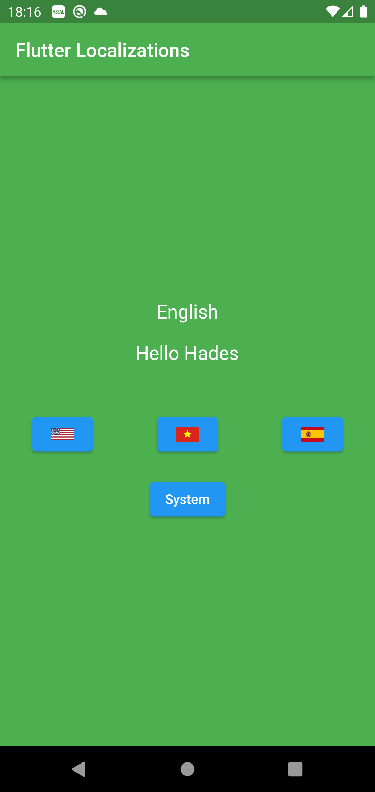

# flutter_dynamic_localization

- Example of Flutter dynamic localization

### What's .arb file ?

ARB is google's format for localization, it is used in the web and in flutter framework.

- [https://github.com/google/app-resource-bundle/wiki/ApplicationResourceBundleSpecification](https://github.com/google/app-resource-bundle/wiki/ApplicationResourceBundleSpecification) 

- [https://docs.flutter.dev/development/accessibility-and-localization/internationalization](https://docs.flutter.dev/development/accessibility-and-localization/internationalization)

 

